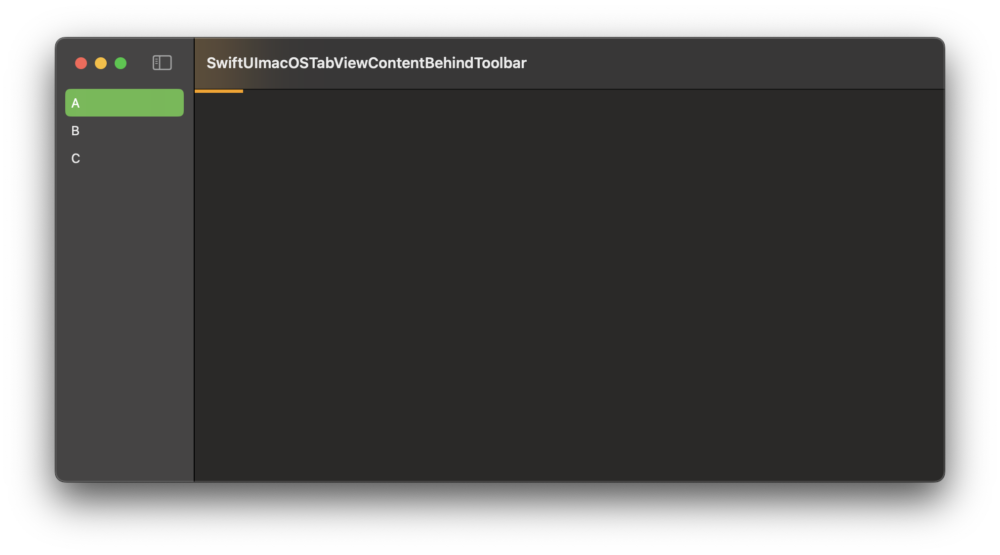

# FB15147353 - SwiftUI macOS: TabView content behind Toolbar

## Scenario

A SwiftUI macOS app using TabView with .sidebarAdaptable. Each Tab (sidebar entry) shows a NavigationStack with a Scrollview.

## Issue

When changing the selection, the content view appears partly hidden behind the navigation bar. Scrolling down it is visible again. It seems like the scroll view appears with a offset.

	
## Example code

The example shows a SplitView with 3 entries. On Start the first content view is displayed correctly. Changing to a different item, the content shows the broken state.

  

## Workaround

Adding `.offset(y: 1)` or `.padding(1)` on the ScrollView fixes it (`ContentView.swift:38`).

## Tested on

	- Xcode Version 16.0 RC (16A242) on macOS 15.0

